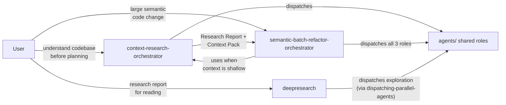
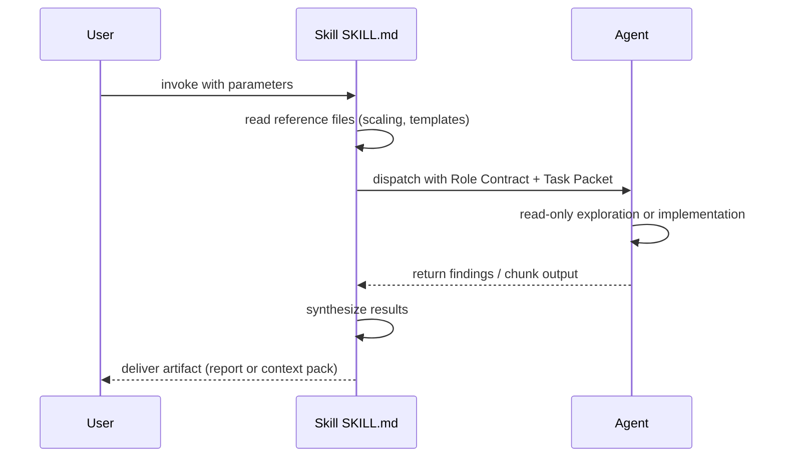
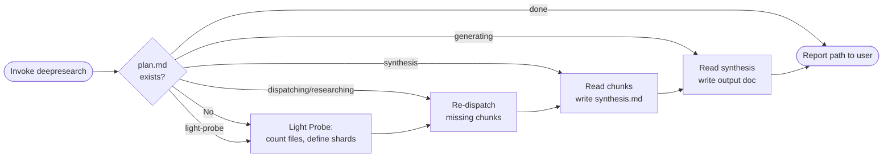

# skills — Deep Research Report
> Generated: 2026-03-19 | Mode: quick | Commit: 4bd2d7e

---

## 1. Project Overview

`skills` is a Claude Code skills repository containing three orchestration skills for complex agentic workflows. It provides a shared child-agent role library and a documentation structure that separates design specs from implementation plans. The three skills cover: codebase research for downstream agents (`context-research-orchestrator`), user-facing codebase research reports (`deepresearch`), and large-scale semantic code refactoring (`semantic-batch-refactor-orchestrator`). All skills share a common three-layer architecture: Role Contract + Task Packet + Skill.

### Directory Structure

```mermaid
graph TD
  root["skills/"]
  root --> README["README.md"]
  root --> agents["agents/ — shared role contracts"]
  root --> cro["context-research-orchestrator/"]
  root --> dr["deepresearch/"]
  root --> sbro["semantic-batch-refactor-orchestrator/"]
  root --> docs["docs/"]
  root --> superpowers["superpowers/ (git submodule)"]

  agents --> roa["read-only-exploration-agent.md"]
  agents --> ia["implementation-agent.md"]
  agents --> scr["spec-conformance-reviewer.md"]

  cro --> cro_skill["SKILL.md"]
  cro --> cro_refs["references/ (output-templates, delegation-guidance)"]
  cro --> cro_agents["agents/ (local role copy)"]

  dr --> dr_skill["SKILL.md"]
  dr --> dr_refs["references/ (scaling, plan-template, output-template)"]
  dr --> dr_agents["agents/ (exploration-agent)"]

  sbro --> sbro_skill["SKILL.md"]
  sbro --> sbro_agents["agents/ (3 local role copies)"]

  docs --> specs["orchestration/specs/ (4 design specs)"]
  docs --> plans["orchestration/plans/ (3 impl plans)"]
  docs --> research["orchestration/research/ (empty)"]
```

### Skill Relationship Map

---

## 2. Core Flows

### Skill Invocation Flow (any skill)

### deepresearch Resume Flow

---

## Appendix

### Coverage
- `README.md`
- `agents/` — all 3 role contracts
- `context-research-orchestrator/` — all files
- `deepresearch/` — all files
- `semantic-batch-refactor-orchestrator/` — all files
- `docs/orchestration/specs/` — all 4 specs
- `docs/orchestration/plans/` — CRO and deepresearch plans (fully), SBRO plan (skipped)

### Exclusions
- `superpowers/` — git submodule, excluded per research scope
- `.git/` — version control internals
- `docs/orchestration/plans/2026-03-18-semantic-batch-refactor-orchestrator.md` — structural duplicate of CRO plan at quick depth

### Confidence Markers
- [Fact] Three active skills: `context-research-orchestrator`, `deepresearch`, `semantic-batch-refactor-orchestrator`
- [Fact] Three-layer agent architecture (Role Contract + Task Packet + Skill) is the central pattern
- [Fact] `dispatching-parallel-agents` referenced by `deepresearch` but absent from repo (likely in `superpowers/` submodule)
- [Fact] `docs/orchestration/research/` is empty — no persisted CRO artifacts yet
- [Inference] `superpowers/` submodule provides `dispatching-parallel-agents` and execution skills referenced in plans
- [Open Question] Is `dispatching-parallel-agents` available inside `superpowers/`?
- [Open Question] Should `deepresearch` plan.md support a `paused` status for long deep-mode runs?
