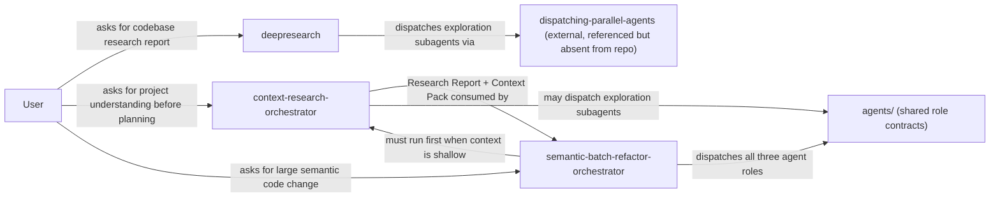

# Chunk 01 — full-repo

## Diagram

```mermaid
graph TD
  root["skills/ (repo root)"]
  root --> README["README.md"]
  root --> agents["agents/"]
  root --> cro["context-research-orchestrator/"]
  root --> dr["deepresearch/"]
  root --> sbro["semantic-batch-refactor-orchestrator/"]
  root --> docs["docs/"]

  agents --> roa["read-only-exploration-agent.md"]
  agents --> ia["implementation-agent.md"]
  agents --> scr["spec-conformance-reviewer.md"]

  cro --> cro_skill["SKILL.md"]
  cro --> cro_refs["references/"]
  cro --> cro_agents["agents/"]
  cro --> cro_ps["pressure-scenarios.md"]
  cro_refs --> cro_ot["output-templates.md"]
  cro_refs --> cro_dg["delegation-guidance.md"]
  cro_agents --> cro_roea["read-only-exploration-agent.md (local copy)"]

  dr --> dr_skill["SKILL.md"]
  dr --> dr_agents["agents/"]
  dr --> dr_refs["references/"]
  dr_agents --> dr_ea["exploration-agent.md"]
  dr_refs --> dr_ss["subagent-scaling.md"]
  dr_refs --> dr_pt["plan-template.md"]
  dr_refs --> dr_odt["output-document-template.md"]

  sbro --> sbro_skill["SKILL.md"]
  sbro --> sbro_agents["agents/"]
  sbro --> sbro_ps["pressure-scenarios.md"]
  sbro_agents --> sbro_ia["implementation-agent.md (local copy)"]
  sbro_agents --> sbro_roea["read-only-exploration-agent.md (local copy)"]
  sbro_agents --> sbro_scr["spec-conformance-reviewer.md (local copy)"]

  docs --> docs_orch["orchestration/"]
  docs_orch --> docs_specs["specs/"]
  docs_orch --> docs_plans["plans/"]
  docs_orch --> docs_res["research/ (.gitkeep)"]
  docs --> docs_dr["deepresearch/"]
```

## Module Summaries

### `README.md`
The repository root index. Documents the skill layout, a skill index table (name, purpose, status, key files), per-skill sections with main files and related docs, a pattern for adding new skills, and maintenance notes. Establishes top-level conventions: one directory per skill, design specs under `docs/orchestration/specs/`, implementation plans under `docs/orchestration/plans/`, research artifacts under `docs/orchestration/research/`.

### `agents/` — Shared Role Contracts
Three role-contract files used across multiple skills. They define stable, cross-skill behavioral identities for child agents — boundaries, not workflows. `read-only-exploration-agent.md` defines a research-only subagent that classifies findings as Fact/Inference/Open Question and stops-and-reports rather than guessing. `implementation-agent.md` defines a controlled execution agent operating within a frozen rule set, escalating scope conflicts instead of improvising. `spec-conformance-reviewer.md` defines a review agent emitting three verdicts (Conformant / Partially Conformant / Non-Conformant), refusing to approve when the review basis is insufficient.

### `context-research-orchestrator/`
Research-only orchestration skill that builds trustworthy project context before planning or multi-agent execution. Produces two durable artifacts: `Research Report` (human-readable summary) and `Context Pack` (machine-reusable blocks with provenance, citations, freshness metadata). Enforces evidence-driven escalation, explicit certainty labels, drift-resistant citations, and read-only subagent delegation. Natural upstream precursor to `semantic-batch-refactor-orchestrator`. Reference files carry output templates and delegation guidance. `pressure-scenarios.md` provides 8 adversarial test scenarios.

### `deepresearch/`
User-facing codebase research skill producing a single layered Markdown document with embedded Mermaid diagrams. Accepts `depth` (quick/standard/deep) and `target` (repo path). Five phases: Intake → Resume Check (`state/plan.md` enables safe restart) → Light Probe (counts files, defines shards) → Parallel Research (dispatches N exploration subagents) → Synthesis → Document Generation. Persistent state in `docs/deepresearch/<repo>-<date>/state/` makes the skill context-reset-safe. Distinct from `context-research-orchestrator`: output is for human readers, not downstream agents.

### `semantic-batch-refactor-orchestrator/`
Specification-first orchestration skill for large semantic code changes (logging migrations, API replacements, schema rewrites). Central principle: rules must be frozen before broad implementation begins. 12-step workflow enforces requirement clarification, optional formal research via CRO, rules specification writing, trial calibration, conflict-aware ownership partitioning, user approval checkpoint, parallel execution, and feedback-driven rule correction. Hard rules: no overlapping file ownership; shared definition files stay with primary agent; no broad execution before user approval. Uses all three shared agent roles. `pressure-scenarios.md` provides 10 adversarial test scenarios.

### `docs/orchestration/specs/`
Four design specifications covering CRO (15 sections), SBRO (problem framing + workflow), the three-layer child-agent system design, and the deepresearch skill design. All four are the source-of-truth architecture documents for this repository.

### `docs/orchestration/plans/`
Three implementation plans (step-by-step agentic checklists): CRO (5 tasks), SBRO, and deepresearch (8 tasks). Plans reference `superpowers:subagent-driven-development` and `superpowers:executing-plans` as required execution sub-skills.

### `docs/orchestration/research/`
Intentionally empty (`.gitkeep` only). Intended destination for persisted `context-research-orchestrator` Research Reports and Context Packs. No CRO runs have produced persisted output in this repo yet.

## Key Findings

- [Fact] Repository contains exactly three active skills: `context-research-orchestrator`, `deepresearch`, `semantic-batch-refactor-orchestrator`. `superpowers/` is a git submodule excluded from this analysis.
- [Fact] A three-layer child-agent system is the architectural backbone: Role Contract + Task Packet + Skill. Documented in `docs/orchestration/specs/2026-03-18-subagent-role-system-design.md`.
- [Fact] Three shared role contracts exist in `agents/`. All three are duplicated locally under `semantic-batch-refactor-orchestrator/agents/`. CRO and deepresearch each keep one locally (CRO: verbatim copy of read-only-exploration-agent; deepresearch: skill-specific variant).
- [Fact] `context-research-orchestrator` is the required upstream precursor to `semantic-batch-refactor-orchestrator` when repository understanding is shallow. Explicitly stated in SBRO's SKILL.md.
- [Fact] `deepresearch` output is for human readers; `context-research-orchestrator` output is for downstream agents. Two distinct consumers, two distinct skills.
- [Fact] Certainty labels (Fact / Inference / Open Question / Decision Blocker) are used consistently across all three skills and all three shared role contracts — a cross-cutting convention enforced repo-wide.
- [Fact] `dispatching-parallel-agents` is referenced in `deepresearch/SKILL.md` Phase 3 but does not exist in this repository outside `superpowers/`.
- [Fact] `docs/orchestration/research/` contains only `.gitkeep` — no persisted CRO research artifacts exist yet.
- [Inference] Local role-contract copies in skill subdirectories create a maintenance risk: if shared contracts in `agents/` evolve, local copies may drift. The CRO local copy acknowledges this explicitly ("skill-local runtime copy").
- [Inference] The `superpowers/` submodule likely contains `dispatching-parallel-agents` and the execution skills (`subagent-driven-development`, `executing-plans`) referenced in implementation plans. These are runtime dependencies not bundled directly in this repo.
- [Open Question] `dispatching-parallel-agents` — available inside `superpowers/` or missing entirely?
- [Open Question] Two unresolved design questions from `deepresearch` spec: (1) `paused` status for `plan.md`; (2) executive summary block for quick mode.

## Coverage

- Analyzed: README.md, agents/ (all 3 files), context-research-orchestrator/ (all files), deepresearch/ (all files), semantic-batch-refactor-orchestrator/ (all files), docs/orchestration/specs/ (all 4 specs), docs/orchestration/plans/ (CRO + deepresearch plans fully; SBRO plan skipped), docs/orchestration/research/ (confirmed empty), docs/deepresearch/skills-2026-03-19/state/plan.md
- Skipped: superpowers/ (excluded per instructions), .git/ (excluded), docs/orchestration/plans/2026-03-18-semantic-batch-refactor-orchestrator.md (structural duplicate of CRO plan, quick mode), docs/deepresearch/skills-2026-03-19/state/chunks/ (empty at analysis time)
