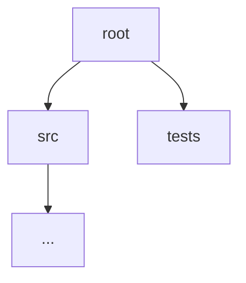
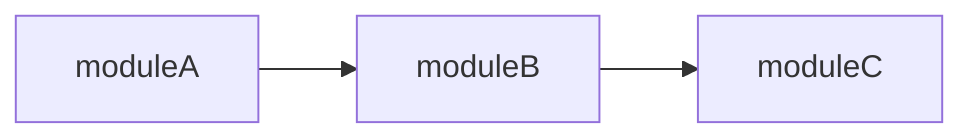
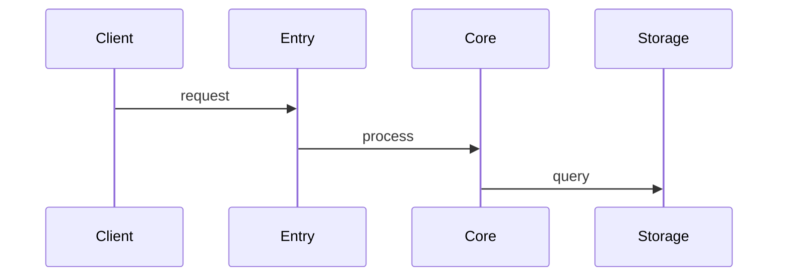
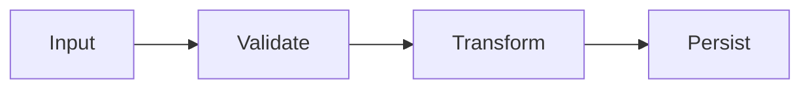

# Output Document Template

The final document is written to `output/YYYY-MM-DD-<repo>-research.md` inside the state directory.

## Mode Coverage

| Section | quick | standard | deep |
|---------|-------|----------|------|
| 1. Project Overview | ✓ | ✓ | ✓ |
| 2. Core Flows | main flow only | ✓ | ✓ |
| 3. Module Deep-Dive | — | key modules | all modules |
| 4. Design Insights | — | ✓ | ✓ + git history |
| Appendix | ✓ | ✓ | ✓ |

## Document Template

```markdown
# [Project Name] — Deep Research Report
> Generated: YYYY-MM-DD | Mode: quick/standard/deep | Commit: <git-sha>

---

## 1. Project Overview

[One paragraph: what this project is and what it does.]

### Directory Structure



### Module Dependency Map



---

## 2. Core Flows

### Primary Request Chain



### Data Flow
[standard + deep only]



---

## 3. Module Deep-Dive
[standard: key modules only; deep: all modules; omit entirely for quick]

### [Module Name]
- **Responsibility:** ...
- **Key files:** `path/to/file.ts:line`
- **Public interface:** ...
- **Internal logic notes:** ...

---

## 4. Design Insights
[standard + deep only; omit for quick]

- **Observed patterns:** ...
- **Trade-offs and coupling risks:** ...
- **Git history notes:** [deep only] ...

---

## Appendix

### Coverage
- Analyzed: [list of directories/files]

### Exclusions
- [path]: [reason skipped]

### Confidence Markers
- [Fact]: ...
- [Inference]: ...
- [Open Question]: ...
```

## Mermaid Diagram Guidance

- **Directory Structure**: use `graph TD` (top-down tree)
- **Module Dependencies**: use `graph LR` (left-right, shows import/call direction)
- **Request Chains**: use `sequenceDiagram`
- **Data Flows**: use `flowchart LR`
- Keep each diagram to ≤ 15 nodes. If a diagram would exceed this, split into sub-diagrams with a title for each.
