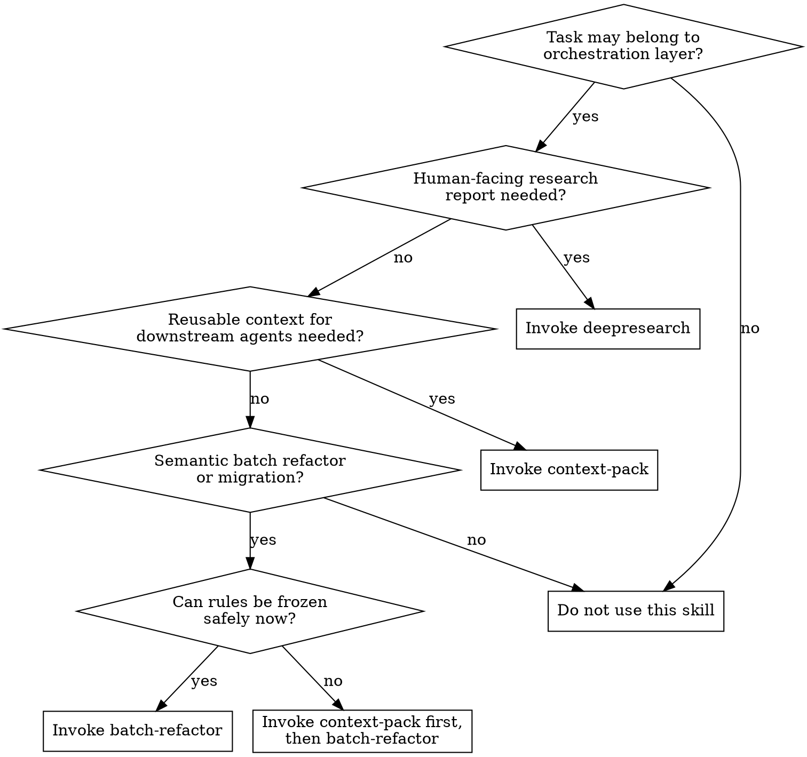

# Using Orchestration Skills

Choose among the orchestration skills in this repository by identifying the output consumer first, then the execution risk.

This skill is a router, not a replacement for the downstream skill. Its job is to decide whether to use `deepresearch`, `context-pack`, or `batch-refactor`, and in what order.

If this skill applies, the agent must make the routing decision before doing the underlying research or orchestration work. Once the correct downstream skill is identified, the agent must invoke it immediately rather than continuing inline.

## Core Rule

**Choose by output consumer first, then by execution risk.**

- If the output is mainly for a human reader, prefer `deepresearch`.
- If the output must be reusable by downstream agents, plans, or later orchestration steps, prefer `context-pack`.
- If the task is a large semantic code change that needs frozen rules and conflict-aware execution, prefer `batch-refactor`.

## Hard Rule

- If there is a real possibility that the task belongs to the orchestration layer in this repository, use this skill to route it before proceeding.
- Do not start repository research inline just because the task looks familiar.
- Do not start semantic refactor orchestration inline just because the migration pattern looks obvious.
- Do not treat a human-facing research request as interchangeable with downstream-agent context packaging.
- Once the correct downstream skill is identified, invoke it immediately.

## Routing Flow

## Decision Table

| Situation | Skill |
| --- | --- |
| The user wants to understand how a repository works, map modules, or receive a readable report | `deepresearch` |
| The next step needs source-backed findings packaged for later agents or workflows | `context-pack` |
| The task is a broad semantic refactor or migration with risky parallel execution | `batch-refactor` |
| The task is a semantic batch refactor, but the rules cannot yet be frozen safely | `context-pack` first, then `batch-refactor` |

## Skill Boundaries

### Use `deepresearch` when

- the deliverable is a document for a human to read
- the user wants layered explanation, diagrams, or a broad repository map
- the immediate need is understanding, not downstream execution packaging

`deepresearch` produces a human-facing report. It does not replace a `Context Pack`.

### Use `context-pack` when

- later agents need reusable, source-backed context
- planning depends on verified boundaries, shared files, or call paths
- rule-freezing or task partitioning would be unsafe without structured research
- a semantic refactor may be coming next, and research must feed `batch-refactor`

`context-pack` produces a `Research Report` plus a `Context Pack` for downstream use.

### Use `batch-refactor` when

- the change spans many files or modules
- the mapping is semantic, not a simple text replacement
- multiple agents could diverge without a frozen rules specification
- shared files, exceptions, and ownership boundaries must be controlled

`batch-refactor` is for execution orchestration after the rules are clarified enough to freeze.

## Context-Pack Before Batch-Refactor

Run `context-pack` before `batch-refactor` when any of these are true:

- the task crosses 3 or more modules
- shared files, event definitions, or common types are not yet located
- the agent cannot write the new rule and exceptions without reading source first
- the likely edit surface is still unclear

If a fresh `Context Pack` already exists and is still usable, `batch-refactor` may consume it directly instead of re-running `context-pack`.

## Red Flags

These thoughts usually mean the agent is about to bypass the router:

| Thought | Required response |
| --- | --- |
| "I can just do a quick repo scan first." | Route first. The difference between human-facing research and reusable context must be decided before exploring deeply. |
| "This is obviously a migration, I can go straight into execution." | Confirm whether `batch-refactor` is the right skill and whether `context-pack` is required first. |
| "The user only asked to understand the code, so any research skill is fine." | Distinguish whether the deliverable is for a human reader or for downstream agents. |
| "I already know these skills, so I can improvise the sequence." | Follow the routing rules explicitly and then invoke the selected skill. |
| "This task only touches a few files, so I do not need an orchestration decision." | Small scope can still require routing if the consumer or handoff target is unclear. |

## Non-Goals

Do not use this skill as:

- a universal startup skill for every conversation
- a replacement for the workflow inside `deepresearch`, `context-pack`, or `batch-refactor`
- a generic planning or implementation skill

This skill selects and sequences. The downstream skill still owns the actual work.

## Handoff Rule

After deciding the right path:

1. Invoke the selected orchestration skill immediately.
2. If the choice is `context-pack -> batch-refactor`, complete `context-pack` first and carry its findings forward with their labels intact.
3. Do not flatten `Inference`, `Open Question`, or `Decision Blocker` into settled facts during handoff.

## Dispatch Priority

When this skill selects an orchestration path, that decision overrides any temptation to continue with ad hoc inline exploration. The downstream orchestration skill owns the workflow from that point onward.
